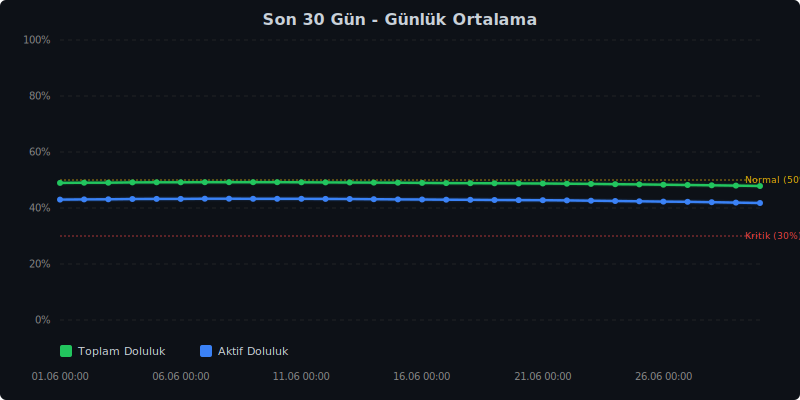
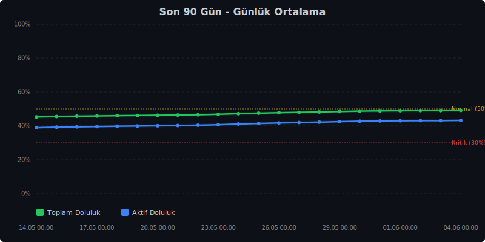
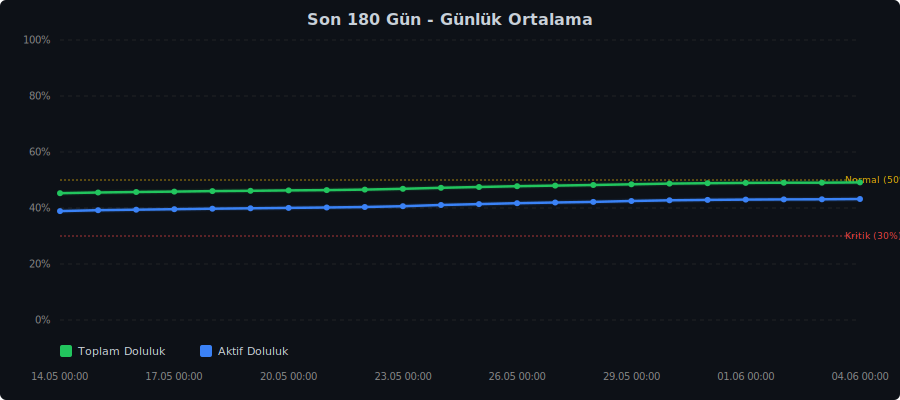
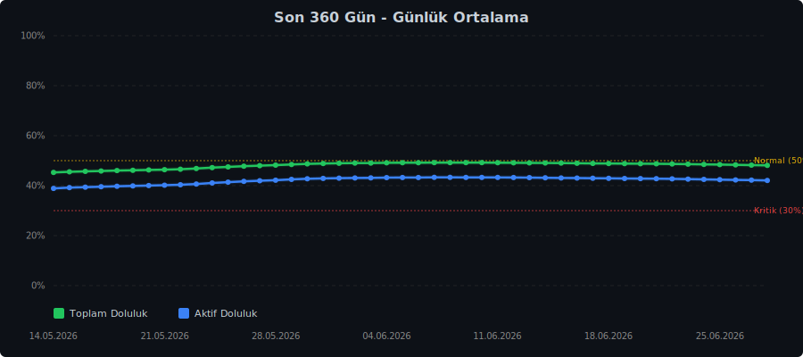
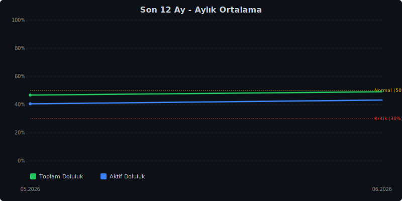

# Ankara Baraj Doluluk Oranlari


## Doluluk Trendleri

### Son 30 Gün


### Son 90 Gün


### Son 180 Gün


### Son 360 Gün


### Son 12 Ay (Aylık Ortalama)


> ASKI verileri ile otomatik guncellenir. Her 8 saatte bir yenilenir.

## Kaynak
- [aski.gov.tr - Baraj Doluluk Oranlari](https://www.aski.gov.tr/tr/baraj.aspx)

## Son Veri
```json
{
  "timestamp": "2026-05-31T17:18:00.931113+00:00",
  "tarih_aski": "30.05.2026",
  "toplam_doluluk": 48.71,
  "aktif_doluluk": 42.74
}
```
