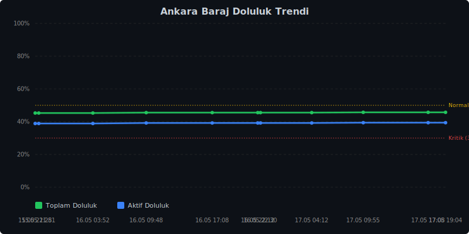

# Ankara Baraj Doluluk Oranlari


## Doluluk Trendi



> ASKI verileri ile otomatik guncellenir. Her 8 saatte bir yenilenir.

## Kaynak
- [aski.gov.tr - Baraj Doluluk Oranlari](https://www.aski.gov.tr/tr/baraj.aspx)

## Son Veri
```json
{
  "timestamp": "2026-05-17T19:04:16.871944+00:00",
  "tarih_aski": "16.05.2026",
  "toplam_doluluk": 45.72,
  "aktif_doluluk": 39.4
}
```
